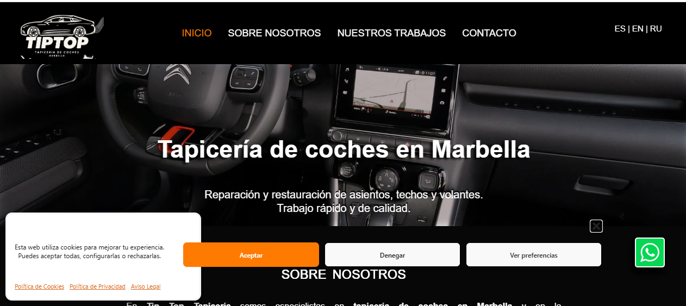
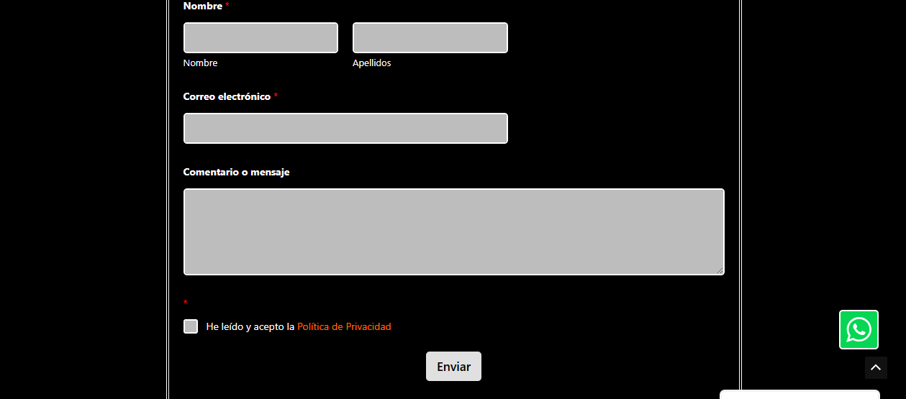
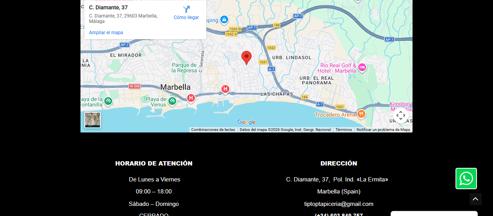

# tiptop-tapiceria-website
# TipTop Tapicería Website

Multilingual business website for a car upholstery workshop in Marbella, Spain.

🌐 Live site: https://tiptoptapiceria.online

## Features
- Multilingual (ES / EN / RU)
- Responsive design
- Contact form with email delivery
- Google Maps integration
- SEO optimization

## Technologies
WordPress · Elementor · PHP · MySQL · HTML · CSS · JavaScript

## Screenshots

### Home page

### Mobile version

### Multilingual menu

### Contact form

### Location map

## Reports Preview

### Revenue by Service

### Monthly Revenue

### Orders by Status

## Author
Elena Yudina  
Junior Web Developer

GitHub: https://github.com/lena050177

