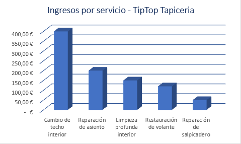
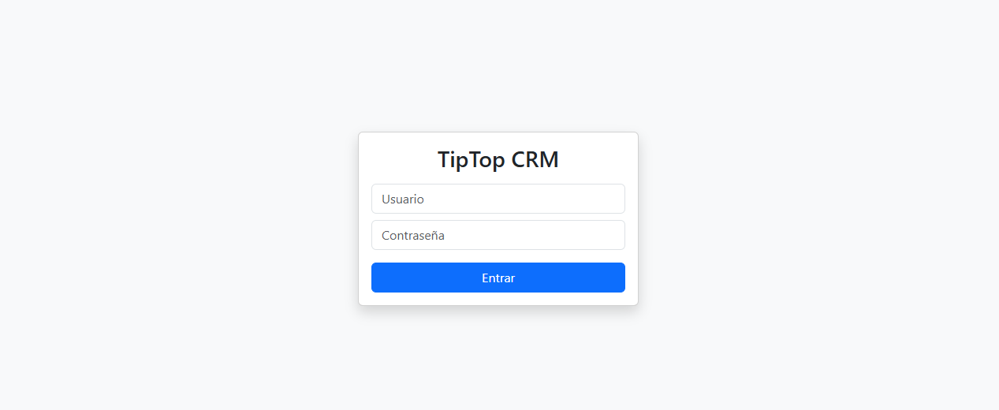
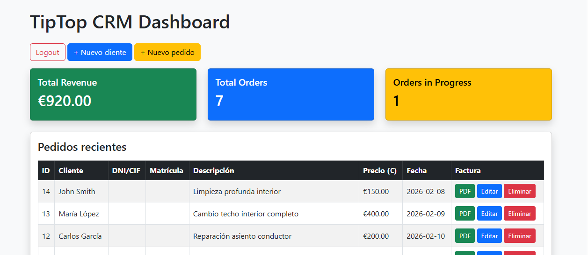
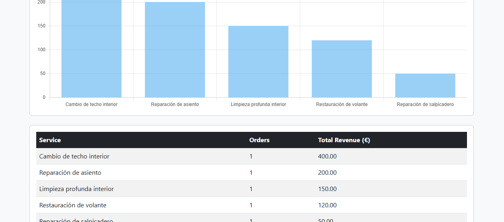

# tiptop-tapiceria-website
# TipTop Tapicería Website

Multilingual business website for a car upholstery workshop in Marbella, Spain.

🌐 Live site: https://tiptoptapiceria.online

## Features
- Multilingual (ES / EN / RU)
- Responsive design
- Contact form with email delivery
- Google Maps integration
- SEO optimization

## Technologies
WordPress · Elementor · PHP · MySQL · HTML · CSS · JavaScript

## Screenshots

### Home page

### Mobile version

### Multilingual menu

### Contact form

### Location map

## Reports Preview

## Revenue by Service

## Monthly Revenue

## Orders by Status

---

## Database Report Tables

### Revenue by Service – SQL Result

### Monthly Revenue – SQL Result

### Orders by Status – SQL Result

---
##TipTop CRM

### Login admin

### Admin Dashboard

### CRM Reports

## Author
Elena Yudina  
Junior Web Developer

GitHub: https://github.com/lena050177

